# ESP32-C3 en Logisim

**Un microcontrolador ESP32-C3 completo, construido como circuito lógico en Logisim Evolution, que corre código escrito como en Arduino y en ESP-IDF, y pasa la suite oficial de pruebas de RISC-V.**

[](https://doi.org/10.5281/zenodo.23135545)   

[English](README.md) · **Español**

Por [Francisco Aldunate](https://franciscoaldunate.cl) · Talca, Chile · versión 0.2 · octubre de 2026

<p align="center">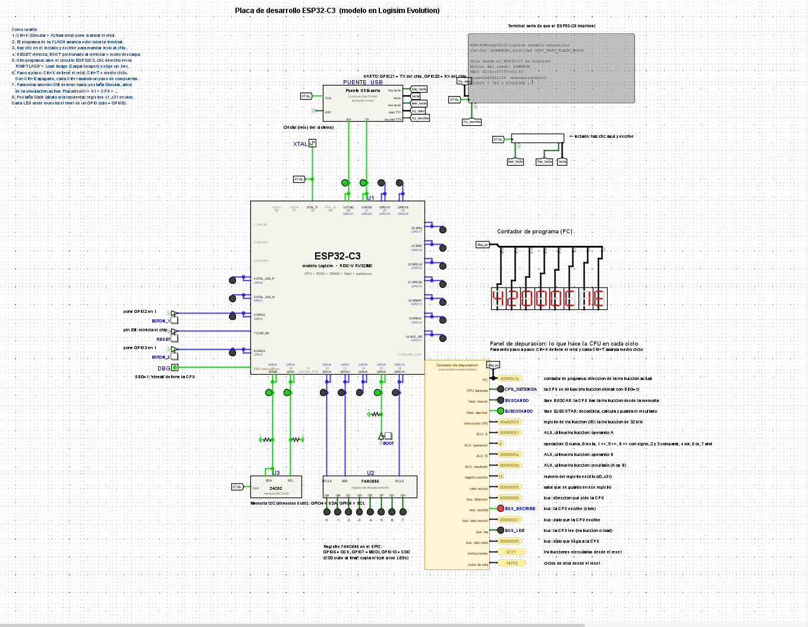</p>

---

## Qué es

Es el ESP32-C3 de Espressif, el microcontrolador RISC-V con WiFi que se usa en millones de aparatos, reconstruido **compuerta por compuerta** en el simulador Logisim Evolution:

- **CPU RISC-V RV32IMC** multiciclo: instrucciones comprimidas (C), multiplicación y división (M), registros de control (CSR), excepciones e interrupciones.
- **Bus del sistema, ROM de arranque, FLASH y SRAM** en las mismas direcciones que el chip real.
- **Periféricos digitales** con los registros del manual técnico de Espressif: GPIO con IO MUX, UART ×2, SYSTIMER, dos grupos de temporizadores con watchdog, RTC_CNTL, PWM (LEDC), SPI, I2C, matriz de interrupciones, SYSTEM y eFuse.
- **Una placa de desarrollo**: botones RESET y BOOT, un LED en cada GPIO, terminal con teclado, una memoria I2C 24C02 y un registro 74HC595 con barra de LEDs.
- **Un SDK** que compila programas estilo **Arduino** (`setup`/`loop`, `Serial`, `Wire`, `SPI`…), estilo **ESP-IDF** (`app_main`, FreeRTOS, `driver/gpio`, `driver/ledc`…) o en C, con el compilador oficial de Espressif.
- **Una versión con la ALU de transistores**: el sumador de 32 bits hecho con 896 transistores CMOS, y un laboratorio con compuertas, flip-flops y un contador hechos con transistores.

Puedes bajar desde el programa hasta el transistor con doble clic: `PlacaDevKit › U1 › CPU › U_ALU › SUMADOR › FA0`.

## El primero de su tipo

Hasta donde pudimos verificar (búsqueda de octubre de 2026), este es **el primer ESP32 recreado en Logisim**. Existen CPUs RISC-V hechas en Logisim y microcontroladores didácticos inventados para el simulador, pero no encontramos ningún modelo en Logisim de **un microcontrolador comercial real**, con su mapa de memoria y sus periféricos, que corra **código escrito para Arduino y ESP-IDF**, ni ningún modelo en Logisim **validado con la suite oficial `riscv-tests`**.

## Verificado con la suite oficial de RISC-V

La CPU pasa las pruebas oficiales [`riscv-tests`](https://github.com/riscv-software-src/riscv-tests) de las extensiones que implementa el ESP32-C3. Cada prueba se compila, se carga en la FLASH y corre en el circuito completo (placa, chip y bus), sin atajos: el resultado sale por la UART.

| Extensión | Pruebas | Versión con compuertas | Versión con ALU de transistores |
|---|---|---|---|
| RV32I (rv32ui) | 40 | ✅ 40 / 40 | ✅ 40 / 40 |
| RV32M (rv32um) | 8 | ✅ 8 / 8 | ✅ 8 / 8 |
| RV32C (rvc, adaptada) | 1 | ✅ 1 / 1 | ✅ 1 / 1 |
| fence.i (adaptada) | 1 | ✅ 1 / 1 | ✅ 1 / 1 |
| **Total** | **50** | **✅ 50 / 50** | **✅ 50 / 50** |

- **Dos pruebas se adaptaron, y en las dos el modelo se comporta igual que el chip real.** `rvc` escribe datos guardados dentro del código, que en el ESP32-C3 vive en la FLASH de solo lectura, y `fence_i` salta a la SRAM por su dirección de datos, cuando el ESP32-C3 solo la ejecuta por su dirección de instrucciones (`0x40380000`). Sin adaptar, el modelo da justo las excepciones que daría el chip (`mcause` 7 y 1). Las versiones adaptadas solo cambian dónde viven los datos o por qué dirección se salta, y prueban exactamente las mismas instrucciones. Están en [`verificacion/env_c3/adaptados`](verificacion/env_c3/adaptados), explicadas línea por línea.
- **`ma_data` no se corre**: prueba accesos desalineados, que el ESP32-C3 no hace por hardware (da una excepción, como el chip real).
- **Control negativo:** el arnés incluye una prueba hecha para fallar (1 + 1 = 3). Falla justo en el caso esperado, así que un PASS significa algo.

Para repetirlo: `git clone --recursive`, instala ESP-IDF y Logisim Evolution 5, y ejecuta `python verificacion/correr_riscv_tests.py`. Los resultados completos están en [`verificacion/`](verificacion).

## Galería

**Lo que escribe la terminal de la placa al arrancar** (salida real, capturada de la simulación):

```
ESP-ROM:esp32c3-logisim (modelo educativo)
rst:0x1 (POWERON),boot:0x8 (SPI_FAST_FLASH_BOOT)

Hola desde el ESP32-C3 en Logisim!
Motivo del reset: POWERON
MAC: 02:4c:47:53:43:33
misa=0x40001104  mvendorid=0x612
123456 * 789 = 97406784 ; 123456 / 789 = 156
Escribe algo en el teclado:
```

Y el ejemplo de FreeRTOS estilo ESP-IDF (`idf/tareas_y_colas`), con el formato real de `ESP_LOGI`:

```
I (5602) tareas: creando tareas
I (9690) tareas: 3 tareas corriendo; presiona BOOT
```

### El chip por dentro

| | |
|---|---|
| 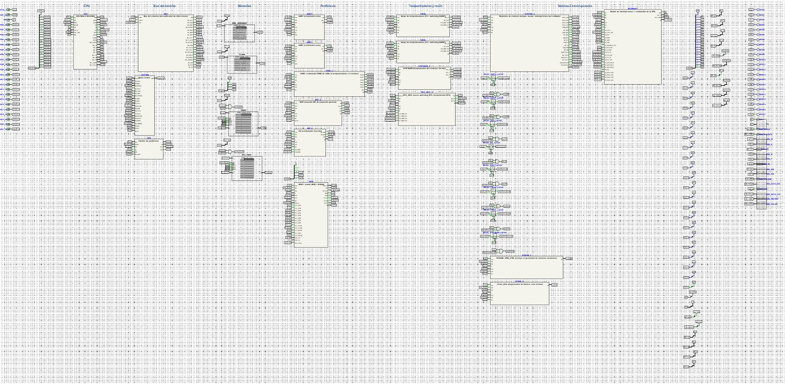 | **El chip, un nivel más abajo.** El circuito `ESP32C3` ordenado como un plano, de izquierda a derecha: CPU, bus del sistema, memorias (ROM de arranque, FLASH, SRAM, RTC), periféricos, temporizadores y reset, y el sistema de interrupciones. Doble clic en cualquier bloque para entrar. |
| 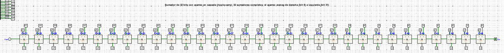 | **El sumador de la ALU en la versión de transistores.** 32 sumadores completos en fila (acarreo en cascada); el acarreo viaja del bit 0, a la derecha, al bit 31, a la izquierda. Cada cuadro es el sumador de 28 transistores de abajo: en cada suma de la CPU participan 896 transistores. |

### Hasta el transistor

<p align="center">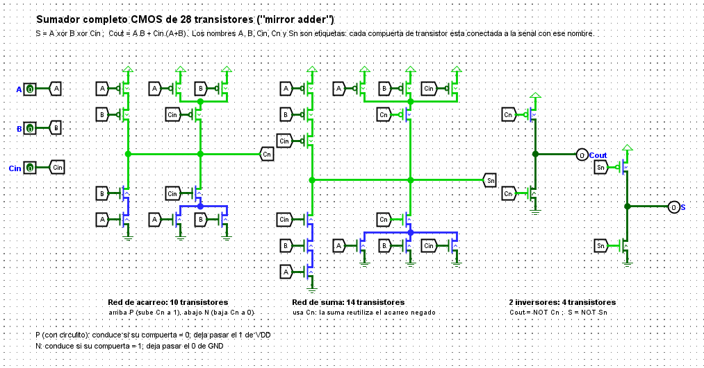</p>

**Sumador completo CMOS de 28 transistores (el «sumador espejo»).** Una red de acarreo de 10 transistores, una red de suma de 14 que reutiliza el acarreo negado, y dos inversores. Los cables en verde claro están en 1; en verde oscuro, en 0.

| | |
|---|---|
| 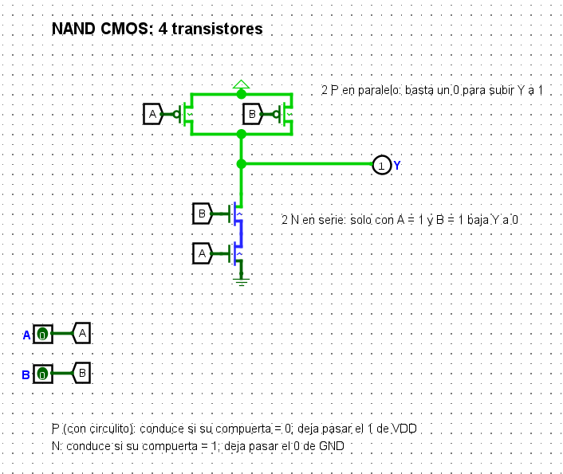 | **NAND CMOS, 4 transistores.** Dos P en paralelo suben la salida a 1, dos N en serie la bajan a 0, y nunca conducen a la vez. |
| 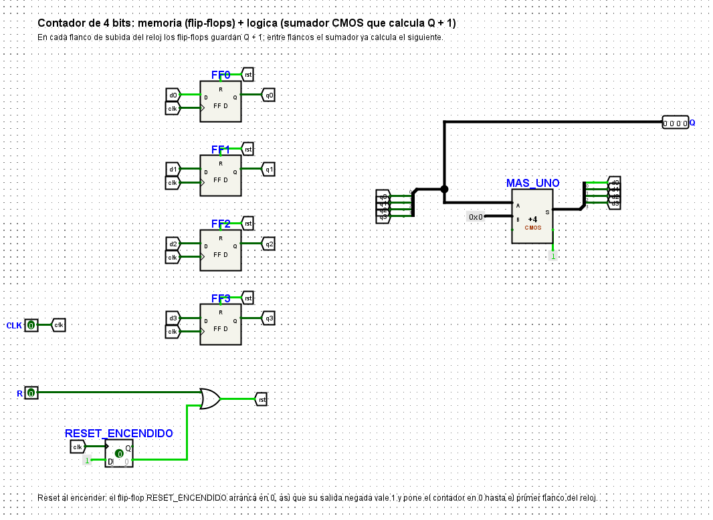 | **Memoria: un contador de 4 bits.** Cuatro flip-flops D hechos con NAND de transistores, y el sumador CMOS calculando Q + 1 entre flancos del reloj. |

<p align="center">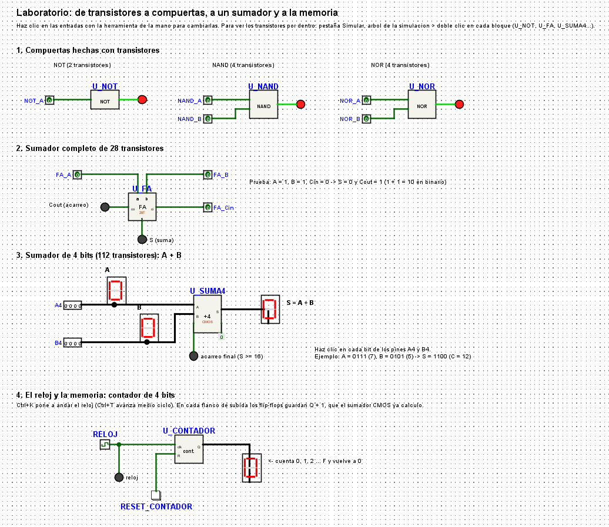</p>

**El laboratorio de transistores** (`LaboratorioTransistores`): compuertas, el sumador completo, un sumador de 4 bits con displays y el contador con su propio reloj, todo interactivo.

### La guía interactiva

`GUIA.html` (español) y `GUIDE.html` (inglés) explican la arquitectura con widgets que funcionan sin internet. Las capturas son de la versión en inglés.

| | |
|---|---|
| 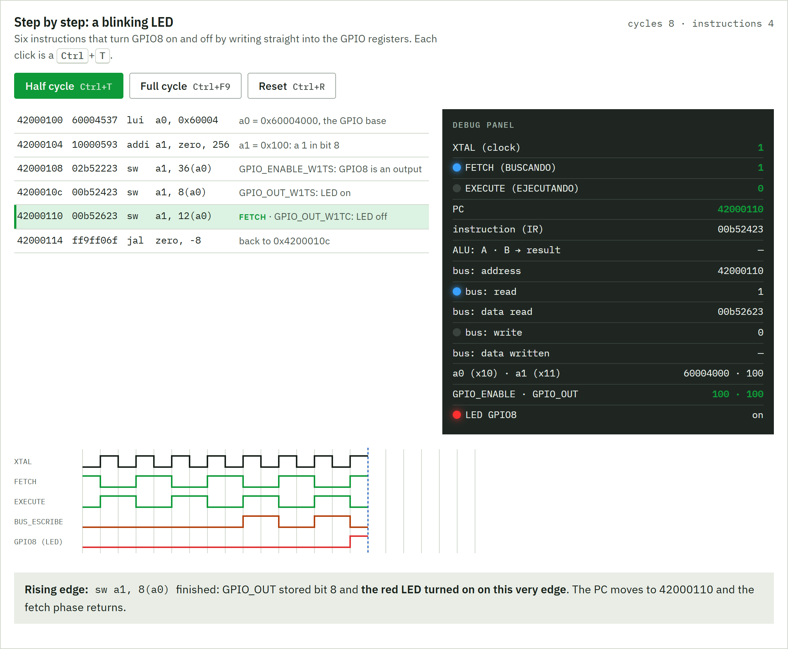 | **Paso a paso.** Seis instrucciones que hacen parpadear el GPIO8, de a medio ciclo de reloj, con el mismo panel de depuración de la placa y un cronograma. Aquí el `sw` a `GPIO_OUT_W1TS` acaba de encender el LED. |
| 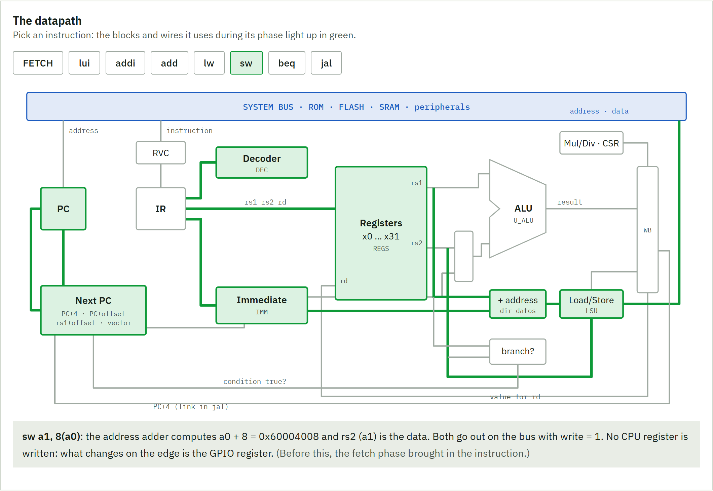 | **El camino de datos.** Eliges una instrucción y ves qué bloques y cables usa. Aquí `sw a1, 8(a0)`: el sumador de direcciones, la unidad de carga y almacenamiento y el bus. |
| 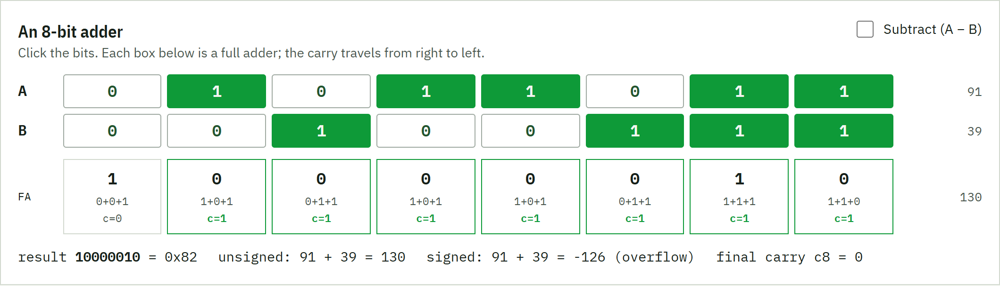 | **Un sumador de 8 bits** en el que haces clic, con el acarreo avanzando por cada sumador completo, resultados con y sin signo y desborde. |
| 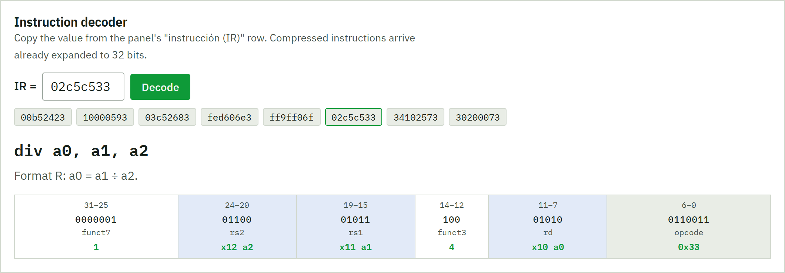 | **Decodificador de instrucciones.** Pegas el valor del IR de la placa y te muestra el ensamblador, qué hace y cada campo de la instrucción. |

---

## Empezar

1. Instala [Logisim Evolution 5](https://github.com/logisim-evolution/logisim-evolution/releases).
2. Abre `ESP32C3_Logisim.circ`.
3. Presiona **Ctrl+K** (Simular › Activar reloj).
4. La ROM de arranque escribe en la terminal y después arranca el programa de la FLASH (`hola_mundo`).
5. Haz clic en el teclado de la placa y escribe: el programa te responde.

Si va lento, sube **Simular › Frecuencia de reloj** al máximo. La velocidad real la pone tu computador.

La explicación completa de cómo funciona por dentro está en **[GUIA.html](GUIA.html)** (ábrela con el navegador; funciona sin internet). Tiene widgets interactivos: el paso a paso de la CPU, el camino de datos, un sumador y un decodificador de instrucciones.

## Qué hay en la carpeta

| | |
|---|---|
| `ESP32C3_Logisim.circ` | La placa con el chip. Empieza por este. |
| `ESP32C3_Logisim_ALU_transistores.circ` | Igual, pero el sumador de la ALU está hecho con 896 transistores (32 sumadores de 28). Un poco más lento. |
| `GUIA.html` · `GUIDE.html` | La guía de arquitectura en español y en inglés. |
| `programas/` | Los 18 ejemplos ya compilados (`.hex`), en `c/`, `arduino/` e `idf/`. |
| `sdk/` | Para compilar tus programas: `compilar.py`, las capas Arduino y ESP-IDF y el código de los ejemplos. |
| `verificacion/` | La suite oficial `riscv-tests` adaptada al modelo, el arnés que la corre y los resultados. |

## Mirar por dentro

- **Panel de depuración** (en la placa, a la derecha del chip): PC, fase de la CPU (BUSCANDO / EJECUTANDO), instrucción, la última operación de la ALU (A, operación, B, resultado), el registro escrito, lo que pasa por el bus y los contadores de ciclos e instrucciones.
- **Pestaña State** (abajo a la izquierda, junto a Properties): los registros `x01_ra` … `x31_t6`, el IR, la fase y los CSR (`mepc`, `mcause`, `mtvec`…), en vivo.
- **Pestaña Simulate** (arriba a la izquierda): doble clic en `PlacaDevKit > U1 > CPU > …` para entrar a cualquier bloque **sin detener** la simulación. (Si haces doble clic en la pestaña Design, Logisim simula ese circuito solo.)
- **Paso a paso**: Ctrl+K detiene el reloj, **Ctrl+T** avanza medio ciclo, **Ctrl+F9** un ciclo completo. Con **Ctrl+E** desactivas la propagación automática y cada **Ctrl+I** avanza las señales una compuerta.
- **Simular › Cronograma**: las señales en el tiempo (reloj, LEDs, registros).
- **Laboratorio de transistores**: pestaña Design, doble clic en `LaboratorioTransistores` (compuertas CMOS, sumador de 28 transistores, flip-flops y un contador). Para volver: doble clic en `PlacaDevKit`.

## Cargar otro programa

Opción rápida: doble clic en `ESP32C3` en la pestaña Design, clic derecho en la ROM **FLASH** › **Cargar imagen…**, elige un `.hex` de `programas/`, vuelve a `PlacaDevKit` y presiona **RESET**.

## Compilar tus programas

Necesitas [ESP-IDF](https://docs.espressif.com/projects/esp-idf/) instalado: trae el compilador RISC-V de Espressif y Python. Funciona en Windows, macOS y Linux.

```
cd sdk
python compilar.py arduino/blink
```

Abre `arduino/blink/logisim/blink.circ`: es el circuito con tu programa ya cargado. Presiona Ctrl+K. (También queda `blink.hex` para cargarlo con Cargar imagen…)

Para tu propio programa, copia una carpeta de ejemplo, cambia el nombre (en Arduino el `.ino` se llama igual que la carpeta), edítalo y compílalo. `compilar.py` reconoce solo el estilo:

| Estilo | Qué necesita | Ejemplo |
|---|---|---|
| Arduino | `setup()` y `loop()` en un `.ino` | `python compilar.py arduino/mi_sketch` |
| ESP-IDF | `app_main()` en un `.c` | `python compilar.py idf/mi_app` |
| C | `main()` usando `sdk.h` | `python compilar.py examples/mi_prueba` |

Opciones: `--ciclos-por-ms N` (cuántos ciclos dura 1 ms del programa; por defecto 1), `--cc RUTA` (el compilador, si no lo encuentra solo), `--sin-circ` (solo el `.hex`), `-v` (muestra los comandos). Busca el compilador en `~/.espressif` y en el core ESP32 del IDE de Arduino.

## Los ejemplos

Los 18 compilan sin advertencias con GCC 15.2 de Espressif.

| Programa | Qué hace | Mira en la placa |
|---|---|---|
| `c/hola_mundo` | Datos del chip, una multiplicación, eco del teclado | terminal |
| `c/parpadeo` | LED rojo parpadea; con BOOT más rápido | GPIO8, BOOT, BOTON_1 |
| `c/interrupciones` | Tres interrupciones: SYSTIMER, botón BOOT y UART | GPIO3, BOOT, teclado |
| `c/temporizadores` | Alarma de TIMG0, interrupción por software y el watchdog reiniciando el chip | GPIO4, terminal |
| `c/pwm` | Tres canales PWM y uno que «respira» por hardware | GPIO0, 1, 3, 18 |
| `c/spi_leds` | Contador y «auto fantástico» en la barra del 74HC595 | LEDs amarillos |
| `c/memoria_i2c` | Escribe y lee la memoria I2C; cuenta los reinicios | terminal, RESET |
| `arduino/blink` | El blink de Arduino | GPIO8 |
| `arduino/boton_interrupcion` | `attachInterrupt` en BOOT | BOOT, GPIO3 |
| `arduino/serial_eco` | `Serial` y `String`: responde lo que escribes | teclado, terminal |
| `arduino/pwm_respira` | `analogWrite` | GPIO18, GPIO0 |
| `arduino/i2c_memoria` | `Wire` con la memoria 24C02 | terminal |
| `arduino/spi_barra` | `SPI` con el 74HC595 | LEDs amarillos |
| `idf/hola_mundo` | El `hello_world` oficial de ESP-IDF | terminal |
| `idf/blink` | El `blink` oficial de ESP-IDF | GPIO8 |
| `idf/tareas_y_colas` | Dos tareas de FreeRTOS y una cola alimentada por una ISR | GPIO1, GPIO3, BOOT |
| `idf/ledc_fade` | `driver/ledc` con fade por hardware | GPIO18, GPIO0 |
| `idf/i2c_memoria` | `driver/i2c` con la memoria 24C02 | terminal |

## Diferencias con el chip real

- **El tiempo va en cámara lenta**: 1 ms del programa = 1 ciclo del modelo. `delay(1000)` son 1000 ciclos.
- **FreeRTOS es cooperativo**: las tareas cambian en `vTaskDelay`, al esperar una cola o semáforo, o con `taskYIELD()`. Una tarea en un ciclo infinito sin pausas no deja correr a las demás.
- **No hay WiFi, Bluetooth ni ADC** (son circuitos de radio y analógicos). `analogRead()` devuelve 0.
- **La UART tiene velocidad fija** (unos 40 ciclos por carácter); `Serial.begin()` acepta cualquier valor.
- **El PWM tiene 8 bits** en hardware; resoluciones mayores se escalan.
- **Se compila el código fuente** con `compilar.py`: un binario de `idf.py build` o del IDE de Arduino no corre en el modelo.
- La CPU es **multiciclo** (unos 2,2 ciclos por instrucción), no un pipeline de 160 MHz.
- Para que la simulación no sea eterna, algunas piezas usan componentes que trae Logisim (registros, memorias, multiplicador, desplazador). El sumador de la ALU está hecho a mano con compuertas, y en la otra versión con transistores.

## Problemas comunes

- **No pasa nada al abrir**: presiona Ctrl+K. Revisa que estés viendo `PlacaDevKit`.
- **Cambié de pestaña y se detuvo**: entraste a un circuito desde la pestaña Design. Vuelve con doble clic en `PlacaDevKit`, o usa la pestaña Simulate para mirar adentro.
- **«No encontré un compilador RISC-V»**: abre la terminal ESP-IDF, o pasa la ruta con `--cc`.
- **Guru Meditation Error en la terminal**: tu programa hizo algo ilegal. `MCAUSE` dice qué (2 = instrucción ilegal, 5/7 = leer/escribir una dirección no permitida) y `MEPC` dónde.

## Autor

**Francisco Aldunate Rodríguez** · Talca, Chile
Desarrollador de firmware ESP32 (P4, S3, C3) y web.
Portafolio: **[franciscoaldunate.cl](https://franciscoaldunate.cl)** · GitHub: [@franciscoaldun](https://github.com/franciscoaldun)

Otros proyectos: [sumador de 4 bits hecho solo con transistores](https://github.com/franciscoaldun/sumador-4-bits-transistores) (el antecesor de este) · [reloj atómico con ESP32-C3](https://github.com/franciscoaldun/reloj-atomico-esp32c3) · [horno fractal para ESP32-C3](https://github.com/franciscoaldun/horno-fractal-esp32c3)

## Cómo citarlo

Si lo usas en clases, en una investigación o en una publicación, cítalo así (GitHub también lo ofrece en «Cite this repository», a partir de [`CITATION.cff`](CITATION.cff)):

> Aldunate Rodríguez, F. (2026). *ESP32-C3 in Logisim: a gate-level ESP32-C3 microcontroller for Logisim Evolution* (versión 0.2). https://doi.org/10.5281/zenodo.23135545

## Licencia

[MIT](LICENSE). La suite `riscv-tests` (en `verificacion/riscv-tests`, como submódulo) mantiene su propia licencia BSD. El ESP32-C3 es un producto de Espressif Systems; este es un modelo educativo independiente, sin relación con Espressif.
